#  Climate Change Data Analysis
## What is the motivation to choose this project, Climate Change Data Analysis?

- Environmental Concerns: With increasing evidence of climate change and its detrimental effects on ecosystems, biodiversity, and natural resources, there's a growing urgency to understand the underlying patterns and drivers of climate change. Analyzing temperature and weather patterns, as well as greenhouse gas emissions, can provide valuable insights into the extent of environmental degradation and the need for mitigation strategies.

- Scientific Inquiry: Climate change is a complex phenomenon influenced by various natural and anthropogenic factors. Conducting a data analysis project allows researchers to delve deeper into the scientific understanding of climate dynamics, explore relationships between different variables, and uncover underlying patterns or trends that may inform future research and policy decisions.

- Policy Implications: Climate change has significant socio-economic implications, affecting various sectors such as agriculture, health, energy, and infrastructure. By analyzing climate data, policymakers can gain a better understanding of the potential impacts of climate change on different regions and populations, enabling them to formulate effective adaptation and mitigation policies to safeguard communities and economies.


## What are the objectives and scopes of the project?
The objectives of this Climate Change Data Analysis project are to analyze temperature and weather patterns over time and identify trends in greenhouse gas emissions. The scope of the project includes predicting future climate scenarios based on historical data.

[Click on the link to know more about the Climate Change.](docs/climate_change_FAQ.md)

## Key Questions
The following are the questions which helped me to explore and analize the different aspects of climate change:

#### 1. How do different sectors such as energy, agriculture, industry, waste, and LULUCF (Land Use, Land-Use Change, and Forestry) contribute to climate change?
#### 2. How do different types of greenhouse gases affect the emission rate over a period of time?
#### 3. What does historical data reveal about the impact of these sectors over a period of time?"
#### 4. How did greenhouse gas emission statistics evolve throughout the years, and were there any discernible trends?
#### 5. How can visualizations enhance our understanding of greenhouse gas emissions and  climate change?
#### 6. How do different hemispheres and latitude bands influence climate change?
#### 7. What does historical data reveal about the impact of different hemispheres and latitude bands over a period of time?
#### 8. How did temperature statistics evolve throughout the years, and were there any discernible trends?
#### 9. How can visualizations enhance our understanding of temperature and  climate change?

## Data Sources

### The greenhouse gas emission data 
The greenhouse gas emission data is sourced from the website [United Nations Framework Convention on Climate Change (UNFCCC)](https://di.unfccc.int/ghg_profile_annex1), which includes historical emission data for each sector such as energy, agriculture, industry, waste, and LULUCF (Land Use, Land-Use Change, and Forestry), along with their sub-sectors and different types of greenhouse gasses. It also provides greenhouse gas emissions data for all countries in AnnexI.

### The historical temperature data 
The historical temperature data is sourced from the website [Goddard Institute for Space Studies (GISS)](https://data.giss.nasa.gov/gistemp/), which includes  historical data for different hemispheres and three latitude bands.

## Data Processing and Data Transformation
- The greenhouse gas emission data for each sector was cleaned and organized using the Python Pandas library to ensure consistency across different dataframes. 
- The greenhouse gas emission data for different types of gasses was cleaned and organized using SQLite database and queries to ensure consistency across different dataframes.
- The greenhouse gas emission data across all the countries in the ANNEXI was cleaned and organized using the Python Pandas library to ensure consistency across different dataframes.
- To replicate the analysis and explore the project's findings on your device, follow the steps outlined in the 
[Getting Started](#Getting_Started) section of this README to complete the necessary set-up. 

## Replicating the Analysis
There are two jupyter notebooks in the folder[notebooks](notebooks). Though each notebook stands alone in its analysis, running in order is recommended:
- [Geenhouse Gas Emission](green_house_gas_analysis.ipynb)
- [Historical Temperature Analysis](historical_temperature_analysis.ipynb)

Additional folders and files available in the repo:
- [Data folder](data)
- [Documents folder](docs)
- [All images for the README.md](ReadmeImages)

<a id="Getting_Started"></a>
## Getting Started
### To replicate this project:

1. Clone the repository to your machine:
    ```bash
    git clone https://github.com/ElizabethGLiz/ClimateChangeAnalysis
    ```
2. Create and activate a virtual environment, and install required packages from 'requirements.txt':
- **Linux/Mac:**
  ```bash
  python3 -m venv venv
  source venv/bin/activate
  pip install -r requirements.txt
  ```
- **GitBash:**
  ```bash
  python -m venv venv
  source venv/Scripts/activate
  pip install -r requirements.txt
  ```
3. Once complete, be sure to deactivate:
    ```
    deactivate
      ```

3. Ensure all data files have successfully moved to the main project directory before running the  analysis notebooks.
4. Run both notebooks.

## Key Findings and Visualization

### Comparative Analysis: Greenhouse Gas Emission

- An important aspect of this comparative analysis involved comparing greenhouse gas emissions across various sectors, different types of gases, and all countries within the United Nations Framework Convention on Climate Change (UNFCCC) Annex I between the years 1991 and 2021.

The following visualizations are provided:

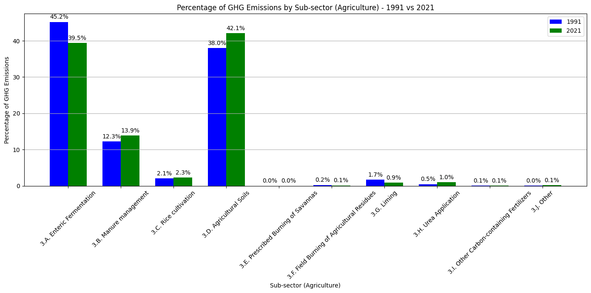

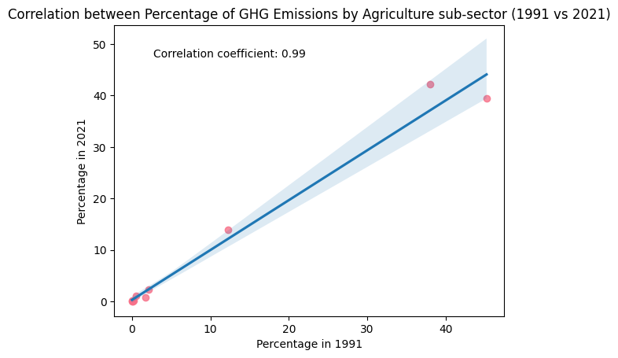

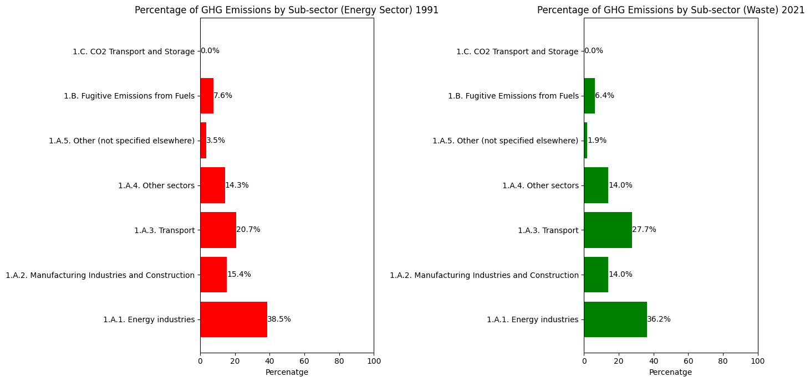
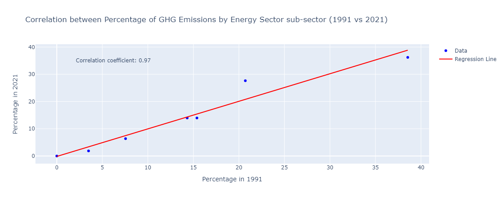

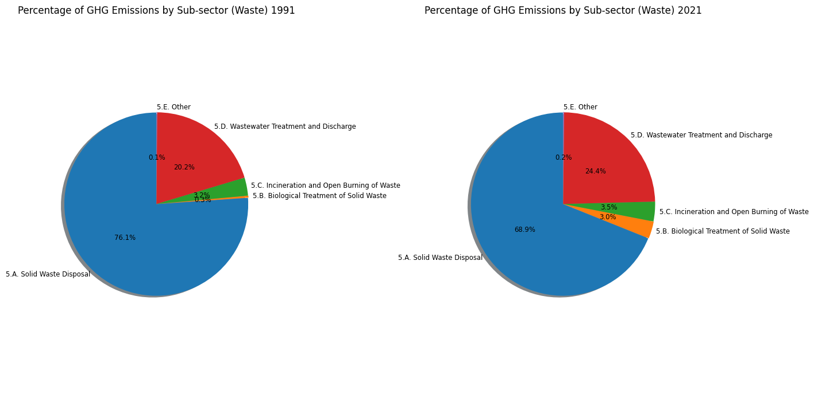

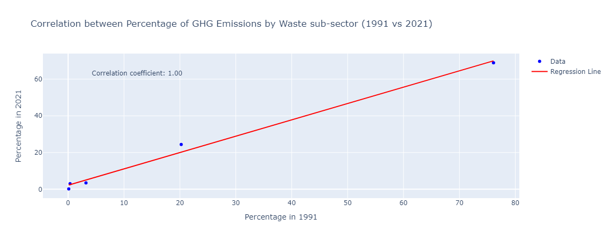

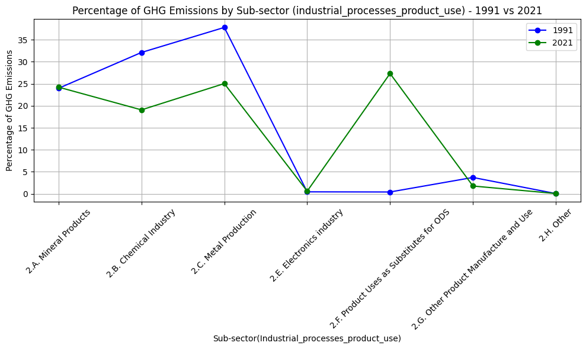

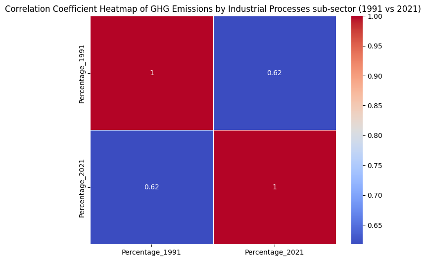

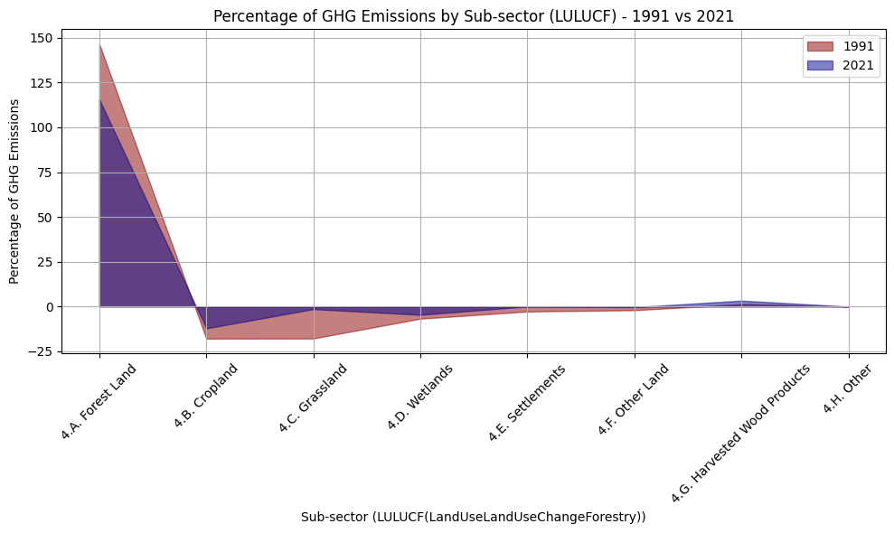

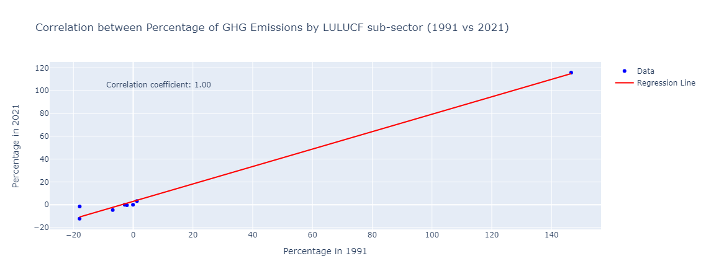

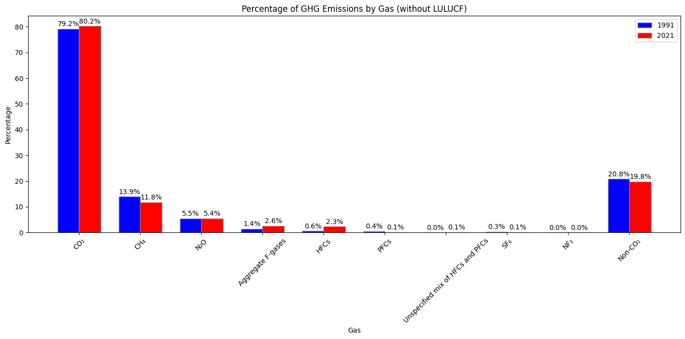

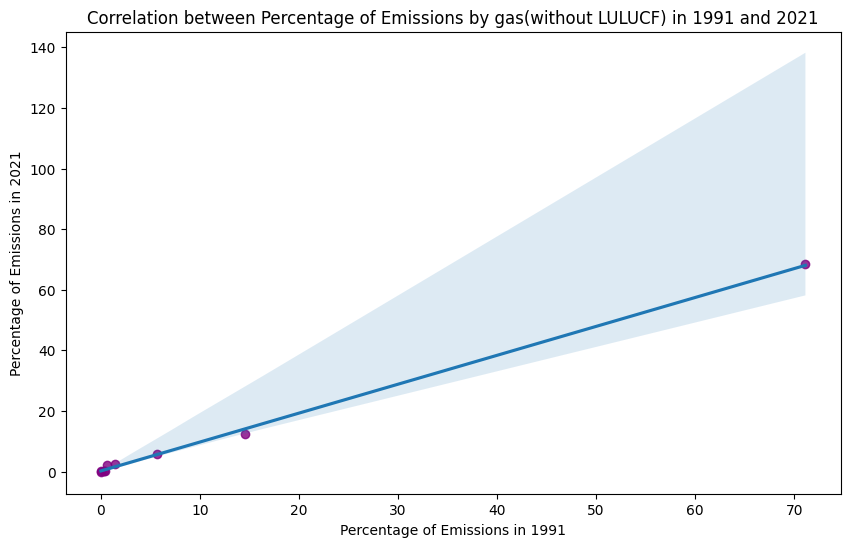

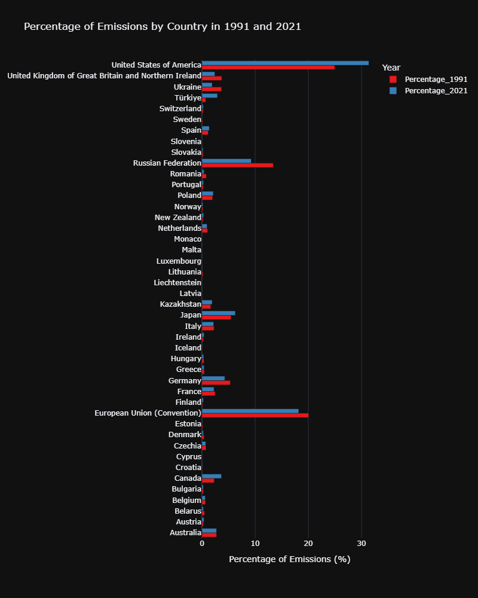

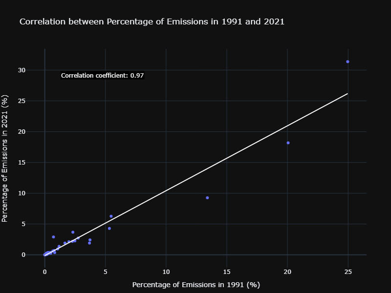


### Comparative Analysis: Historical Temperature Data
 - By comparing the smoothed lines and raw data points between NH and SH, I analyzed the differences or similarities in the temperature trends between the two hemispheres. Differences in temperature trends could be attributed to factors such as geographical features, land distribution, and atmospheric circulation patterns.

 - By comparing the raw data points (markers) for each latitude band, I  analyzed the variability in temperatures within and between the Northern Extratropics, Southern Extratropics, and Tropics. Variations in temperature can be influenced by factors such as geography, ocean currents, atmospheric circulation patterns, and land use.

 - By comparing the temperature trend across land and ocean observed with other climate indicators, such as sea ice extent, greenhouse gas concentrations, or global temperature anomalies, I  gained a comprehensive understanding of climate dynamics and variability.
 

 The following visualizations are provided:

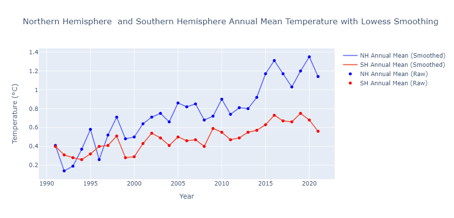

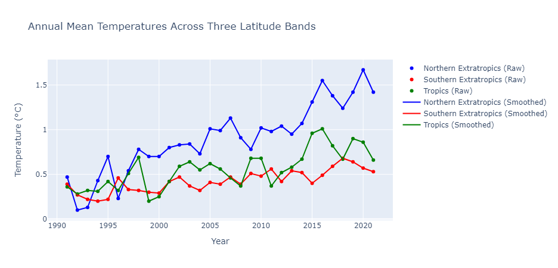

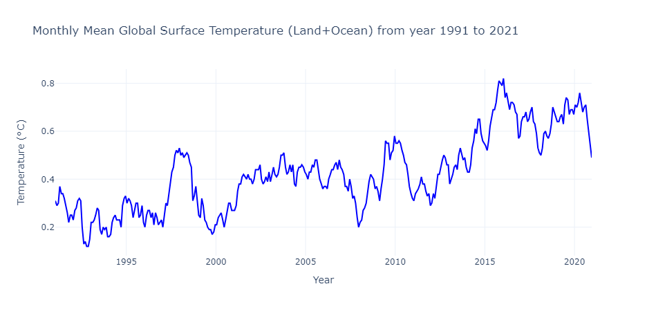

 ## I will be presenting a Tableau visualization to examine the relationship between temperature and population across various countries, utilizing historical data. This analysis aims to explore how temperature fluctuations may correlate with changes in population size over time in different regions.
[Click on the link](https://public.tableau.com/shared/WC4HSS9ZY?:display_count=n&:origin=viz_share_link)


##  Summary

### Greenhouse Gas Emission:
#### Greenhouse Gas Emission By Different Sub-sectors 
- Change in Emissions Composition: Over time, there has been a noticeable shift in the relative contributions of different sub-sectors to total GHG emissions. Comparing data from 1991 and 2021 allows us to observe how the composition of emissions has evolved, indicating changes in industrial activities or emission sources.

- Identification of Dominant Sub-sectors: Certain sub-sectors consistently stand out as major contributors to GHG emissions in both 1991 and 2021. These sub-sectors, with their significant emission shares, represent prime targets for focused mitigation efforts or technological advancements aimed at reducing emissions intensity and overall emissions.

- Comparison of Trends: Examining the trends in emissions percentages for different sub-sectors reveals dynamic patterns over the two decades. Increases or decreases in emissions percentages for specific sub-sectors indicate shifts in industrial practices, regulatory interventions, or technological innovations that have influenced emissions trends over time.

- Assessment of Mitigation Progress: By comparing emissions data between 1991 and 2021, we can gauge the effectiveness of mitigation efforts within the different sub-sectors. Reductions in emissions percentages for high-emitting sub-sectors or transitions towards lower-emission processes signify progress towards emission reduction goals and the success of implemented mitigation measures.

These summaries provide a clear overview of the insights gained from analyzing GHG emissions trends within the different sub-sectors over the specified time period.

#### Greenhouse Gas Emission By Different Types of Gasses
- Shifts in Gas Contributions: Changes in the relative percentages of GHG emissions for different gases indicate shifts in emission sources over time. Analyzing these shifts provides insights into changes in industrial processes, energy consumption patterns, or regulatory interventions affecting GHG emissions.

- Identification of Dominant Gases: Gases with consistently high percentages of emissions across both years signify their significant contributions to total GHG emissions. Understanding which gases dominate emissions helps prioritize mitigation strategies and policy interventions aimed at reducing their emissions.

- Assessment of Progress: Comparing the percentages of GHG emissions for each gas between 1991 and 2021 allows for an assessment of progress in emissions reduction efforts. Decreases in the percentage of emissions for certain gases may indicate successful mitigation measures, while increases may highlight areas requiring additional attention or targeted policies.

- Policy Implications: Insights from the graph can inform policy decisions related to GHG emissions reduction. Policy-makers can use the data to identify gases or sectors requiring more stringent regulations, investment in cleaner technologies, or incentives for emission reduction initiatives.

- Tracking Emission Trends: Tracking the changes in gas emissions percentages over time.

#### Greenhouse Gas Emission Across All Countries In AnnexI.

- Comparison of Emission Contributions: By examining the lengths of the bars for each country, it's possible to assess changes in emission levels over the two decades.

- Identification of High-Emitting Countries: Countries with longer bars in both 1991 and 2021 indicate significant contributors to global emissions. These high-emitting countries may warrant specific attention in international climate negotiations, emission reduction agreements, or collaborative mitigation efforts.

- Changes in Relative Contributions: Shifts in the lengths of bars for individual countries between 1991 and 2021 reveal changes in their relative emission contributions over time. Countries with increasing bar lengths have experienced emissions growth, while those with decreasing lengths have reduced their emissions relative to others.

- Regional Trends: Patterns in emission changes across regions can be observed by grouping countries geographically. Analyzing clusters of countries with similar emission trends provides insights into regional emission dynamics, policy effectiveness, and shared challenges in addressing climate change.

- Policy Effectiveness and Climate Action: By comparing the emission percentages of countries that have implemented specific climate policies or adopted clean energy initiatives, the chart can offer insights into the effectiveness of such measures in reducing emissions. Countries with declining emission percentages may serve as examples of successful climate action strategies.

- Global Emission Trends: Overall trends in global emissions can be inferred from the aggregate data represented in the chart. Increasing or decreasing average emission percentages across all countries reflect broader shifts in global emission levels and progress towards international climate goals.

### Historical Temperature Data:
#### Northern Hemisphere  and Southern Hemisphere Annual Mean Temperature with Lowess Smoothing
- Trend over Time: The smoothed lines for NH and SH Annual Mean temperatures provide an indication of the overall trend in temperature over the years. You can observe whether temperatures are increasing, decreasing, or remaining relatively stable over time.

- Seasonal Variations: The raw data points (markers) for NH and SH Annual Mean temperatures  exhibits some fluctuations, indicating seasonal variations in temperature. These fluctuations can be caused by factors such as changes in solar radiation, ocean currents, and atmospheric circulation patterns.

- Temperature Extremes: The notable spikes or dips in the raw data points  indicates extreme temperature events or anomalies in specific years. These events could be further investigated to understand their causes and potential implications.

- Long-term Climate Patterns: The graph can provide insights into long-term climate patterns and variations, such as periods of warming or cooling trends, which may have implications for climate change research and policy-making.

#### Annual Mean Temperatures Across Three Latitude Bands with Lowess Smoothing
- Comparison of Temperature Trends: The smoothed lines for each latitude band provide insights into the long-term temperature trends in these regions. You can observe whether temperatures are increasing, decreasing, or remaining relatively stable over time in each latitude band.

- Differences in Temperature Variability: By comparing the raw data points (markers) for each latitude band, you can analyze the variability in temperatures within and between the Northern Extratropics, Southern Extratropics, and Tropics. Variations in temperature can be influenced by factors such as geography, ocean currents, atmospheric circulation patterns, and land use.

- Seasonal Variations: Fluctuations in the raw data points  indicates seasonal variations in temperature within each latitude band. These variations can be caused by changes in solar radiation, length of day, and other seasonal factors.

- Response to Climate Events: The  notable spikes or dips in temperature, especially in the raw data points, corresponds to significant climate events or anomalies within each latitude band. These events could include El Niño/La Niña events, volcanic eruptions, or other climate phenomena.

- Verification of Smoothing: Comparing the raw data points to their smoothed versions allows for an assessment of the effectiveness of the smoothing process in capturing the underlying trends in temperature data while reducing noise and variability.
#### Monthly Mean Global Surface Temperature (Land+Ocean) from year 1991 to 2021
- Temperature Trend: The line plot shows the monthly mean global surface temperature over the specified period, providing insights into the overall temperature trend. Analyzing this trend helps understand long-term changes in temperature and identify patterns such as warming trends or fluctuations.

- Land vs. Ocean Temperature: Comparing the temperature trends for land and ocean separately allows for the identification of differences or similarities in temperature changes between these two components of the Earth's surface. Variations in land and ocean temperatures can be influenced by factors such as land use changes, ocean currents, and thermal inertia.

- Other Climate Indicators: By examining additional climate indicators such as sea ice extent, greenhouse gas concentrations, or global temperature anomalies, you can contextualize the temperature trend observed in the land and ocean. These indicators provide complementary information about climate dynamics and can help identify potential drivers of temperature changes, such as changes in greenhouse gas concentrations or feedback mechanisms related to sea ice extent.

## Conclusion
The analysis of greenhouse gas emissions across various sectors and gases, alongside the examination of historical temperature data, reveals valuable insights into climate dynamics and trends over time. By scrutinizing changes in emissions composition, identifying dominant contributors, and assessing mitigation progress, we gain a comprehensive understanding of emission patterns and areas for targeted intervention. Additionally, the comparison of temperature trends across different regions and latitude bands offers insights into long-term climate patterns, variability, and responses to climatic events. These findings underscore the importance of continued monitoring, policy action, and international collaboration in addressing climate change effectively, mitigating its impacts, and fostering sustainable environmental stewardship for future generations.

## Acknowledgments
I wish to extend my heartfelt gratitude to the individuals whose contributions made this modest project achievable.

This project was created as a capstone for the Data Analytics pathway through the [Code:You](https://code-you.org/) program. I am deeply grateful to my mentors for their invaluable guidance and instruction, which enabled me to apply my skills effectively in this project.

A heartfelt thank you also goes out to my family, whose unwavering support was instrumental throughout the development of this project..

"Unite for Our Future: Together, Let's Preserve Our Planet and Combat Climate Change."

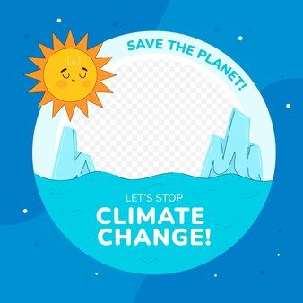

